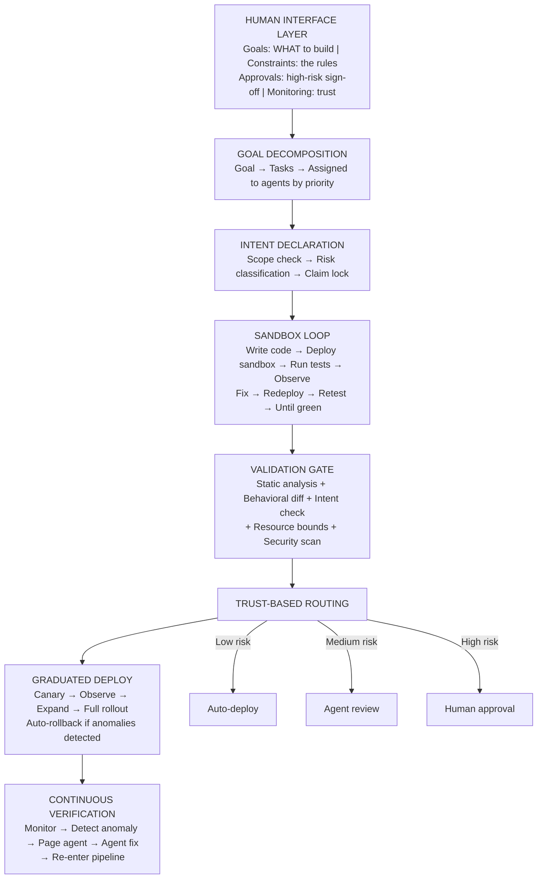

# AI-CICD

CI/CD reimagined for AI agents.

## Architecture



## Human Workflow

The human operates as an air traffic controller: set goals, define constraints, and approve high-risk changes. Agents handle the implementation.

```bash
# Create a goal (this is ALL the human needs to do)
python -m src goal create --title "Add rate limiting" --description "Rate limit /api/users to 100 req/min per client" --priority high

# Check what's happening
python -m src status

# Approve when the system escalates a high-risk change
python -m src approve <run_id>

# Define a constraint agents must follow
python -m src constraint add --rule "All new endpoints require authentication"

# Monitor agent trust scores
python -m src agents
```

For the full operator guide, see [docs/human-workflow.md](docs/human-workflow.md).

## Quick Start

```bash
# Install in development mode
pip install -e ".[dev]"

# Run tests
pytest
```

## Component Overview

| Component | Package | Description |
|---|---|---|
| **Goals** | `src.goals` | Goal creation, decomposition into tasks, priority assignment |
| **Constraints** | `src.constraints` | Architectural rules and boundaries agents must respect |
| **CLI** | `src.cli` | Human operator command-line interface for goals, approvals, and monitoring |
| **Intent Layer** | `src.intent` | Declares what an agent intends to change, validates scope and risk |
| **Sandbox** | `src.sandbox` | Ephemeral execution environments for agent iteration loops |
| **Validation** | `src.validation` | Multi-signal validation framework (static analysis, behavioral diff, etc.) |
| **Trust & Risk** | `src.trust` | Agent trust profiles, risk scoring, and deploy route computation |
| **Coordination** | `src.coordination` | Claim management, semantic merge checking, deploy queue |
| **Pipeline** | `src.pipeline` | Orchestrator that ties all components together end-to-end |

## Design

See [docs/vision.md](docs/vision.md) for the full vision document.

## Status

Active development. Core pipeline, simulation layer, goal/constraint system, and CLI implemented. Next up: real LLM integration for goal decomposition, persistent storage, webhook notifications, and agent SDK.
