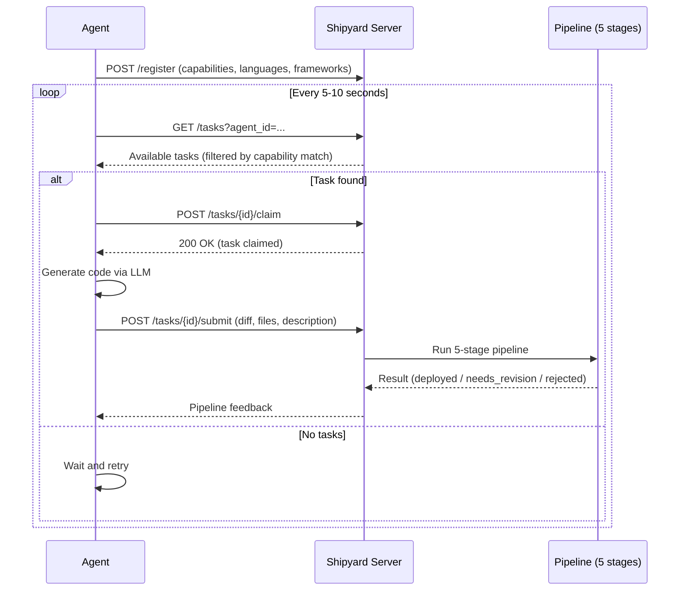

Mar 18, 2026# Shipyard Agent System

Shipyard agents are autonomous coding workers that connect to the Shipyard CI/CD pipeline, pick up tasks, generate code using an LLM, and submit their work for validation and deployment. Humans act as air traffic controllers -- they set goals and constraints, while agents handle the implementation.

Each agent registers with the system declaring its capabilities (e.g., "backend", "qa", "frontend"), then enters a poll loop looking for matching tasks. When a task is found, the agent claims it, generates a solution via an LLM call, and submits a diff that flows through the full 5-stage pipeline: INTENT, SANDBOX, VALIDATION, TRUST_ROUTING, and DEPLOY. The pipeline determines whether the change auto-deploys, gets agent-reviewed, or requires human approval -- agents never bypass this gate.

---

## Architecture

Every agent follows the same lifecycle loop:



### SDK Endpoints

All agent communication goes through the SDK API at `/api/agents/sdk/`:

| Method | Endpoint | Purpose |
|--------|----------|---------|
| POST | `/register` | Register agent with capabilities |
| GET | `/tasks` | Poll for available tasks (optionally filtered by `agent_id`) |
| POST | `/tasks/{id}/claim` | Claim a task for exclusive work |
| POST | `/tasks/{id}/submit` | Submit a diff to trigger the pipeline |

### What Happens After Submit

The submitted diff goes through:

1. **INTENT** -- validates the agent's declared scope matches what it changed
2. **SANDBOX** -- runs the code in an ephemeral environment
3. **VALIDATION** -- 5 parallel signals (static analysis, behavioral diff, intent alignment, resource bounds, security scan)
4. **TRUST_ROUTING** -- risk score determines the deploy route:
   - **auto-deploy** -- low risk, trusted agent
   - **agent-review** -- medium risk (most common for new agents)
   - **human-approval** -- high risk (infra changes, failing validation)
   - **canary** -- gradual rollout for critical paths
5. **DEPLOY** -- executes the routed action

---

## Quick Start

### Prerequisites

- Python 3.11+
- A running Shipyard server (`uvicorn src.api.app:create_app --factory --port 8001`)
- An OpenRouter API key (for LLM-powered agents)

### Run a Generic Agent

```bash
export OPENROUTER_API_KEY='sk-or-v1-...'

# Start a generic agent named "suricata"
python agents/claude_agent3.py suricata
```

A generic agent registers with default capabilities (`python`, `backend`, `testing`), languages (`python`), and frameworks (`fastapi`, `pytest`).

### Run a Specialized Agent with a Profile

```bash
# Backend specialist
python agents/claude_agent3.py suricata --profile agents/profiles/backend.yaml

# QA specialist
python agents/claude_agent3.py lagarto --profile agents/profiles/qa.yaml

# Frontend specialist
python agents/claude_agent3.py unicornio --profile agents/profiles/frontend.yaml

# Architect
python agents/claude_agent3.py rocky --profile agents/profiles/architect.yaml
```

### Run Once (Process One Task and Exit)

```bash
python agents/claude_agent3.py suricata --profile agents/profiles/backend.yaml --once
```

### Override Profile Values via CLI

CLI arguments take precedence over the profile:

```bash
python agents/claude_agent3.py suricata \
    --profile agents/profiles/backend.yaml \
    --capabilities backend api security \
    --languages python go \
    --frameworks fastapi gin
```

---

## Agent Profiles

Profiles are YAML files that define an agent's specialization. They live in `agents/profiles/` and control what tasks the agent receives and how it approaches code generation.

### YAML Schema

```yaml
# Required: the agent's display name
name: suricata

# Required: list of capability tags (see "Available Capabilities" below)
# These determine which tasks the router sends to this agent.
capabilities: [backend, api, database]

# Required: programming languages this agent knows
# Matched against file extensions in task target_files.
languages: [python]

# Optional: frameworks this agent is proficient with
# Matched against keywords in task descriptions and file paths.
frameworks: [fastapi, sqlalchemy, pydantic]

# Optional: system prompt that shapes the LLM's behavior
# Use {agent_name} as a placeholder -- it gets replaced with the agent's ID at runtime.
# Use the YAML pipe (|) for multiline strings.
system_prompt: |
  You are a senior backend Python engineer named {agent_name}.
  ...
```

### Field Reference

| Field | Type | Required | Default | Description |
|-------|------|----------|---------|-------------|
| `name` | string | yes | -- | Display name for the agent |
| `capabilities` | list[string] | yes | `[python, backend, testing]` | Capability tags from the `AgentCapability` enum. Controls task routing. |
| `languages` | list[string] | yes | `[python]` | Programming languages. Matched against file extensions in task targets. |
| `frameworks` | list[string] | no | `[fastapi, pytest]` | Frameworks. Matched against keywords in task text. |
| `system_prompt` | string (multiline) | no | Generic coding prompt | The system prompt sent to the LLM. Shapes the agent's personality, rules, and specialization. |

### How `system_prompt` Shapes Behavior

The system prompt is the single most important field for specialization. It tells the LLM:

- **What role to play** ("You are a QA engineer", "You are a frontend specialist")
- **What to produce** ("ONLY write tests", "Build self-contained SPAs")
- **What to avoid** ("Never touch frontend files", "Never modify backend Python files")
- **Quality standards** ("Use type hints and docstrings", "Test edge cases")

The prompt is formatted at runtime with `{agent_name}` replaced by the agent's ID (e.g., `agent-suricata`).

### Existing Profiles

| Profile | File | Capabilities | Role |
|---------|------|-------------|------|
| **Backend** | `profiles/backend.yaml` | backend, api, database | FastAPI endpoints, SQLite schemas, Pydantic models |
| **Frontend** | `profiles/frontend.yaml` | frontend, ui, design | Vanilla JS SPAs, responsive CSS, accessible HTML |
| **QA** | `profiles/qa.yaml` | testing, qa, security | Pytest suites, edge cases, security tests |
| **Architect** | `profiles/architect.yaml` | architecture, design, review | Design docs, API contracts, architecture decisions |

---

## Available Capabilities

Capabilities come from the `AgentCapability` enum in `src/routing/models.py`. When you declare capabilities in a profile, use the **string value** (lowercase).

| Capability | Value | Description |
|------------|-------|-------------|
| `FRONTEND` | `frontend` | UI components, HTML/CSS/JS, client-side code |
| `BACKEND` | `backend` | APIs, server logic, database operations |
| `DATA` | `data` | Data pipelines, migrations, ETL, schemas |
| `SECURITY` | `security` | Auth, encryption, vulnerability scanning |
| `MOBILE` | `mobile` | iOS, Android, mobile apps |
| `QA` | `qa` | Testing, quality assurance, coverage |
| `DEVOPS` | `devops` | Deployment, Docker, Kubernetes, CI |
| `DOCUMENTATION` | `documentation` | Docs, READMEs, technical writing |
| `FULLSTACK` | `fullstack` | Both frontend and backend |
| `ARCHITECTURE` | `architecture` | System design, module structure |
| `DESIGN` | `design` | Layouts, wireframes, specs |
| `GENERIC` | `generic` | Catch-all fallback (the "ER" in the hospital model) |

### Keyword-to-Capability Mapping

The `TaskAnalyzer` scans task titles and descriptions for keywords to infer what capabilities are needed. These are the trigger keywords for each capability:

| Capability | Keywords |
|------------|----------|
| `frontend` | frontend, ui, css, react, component |
| `backend` | api, endpoint, backend, server, database |
| `data` | data, migration, schema, etl, pipeline |
| `security` | security, auth, encryption, vulnerability |
| `mobile` | mobile, ios, android, app |
| `qa` | test, qa, e2e, coverage |
| `devops` | deploy, docker, k8s, infra, ci |
| `documentation` | docs, readme, documentation |
| `architecture` | architecture, design, module, structure |
| `design` | design, layout, wireframe, spec |

A task with the title "Add authentication endpoint" would trigger both `security` (keyword: "auth") and `backend` (keyword: "endpoint").

---

## Task-to-Agent Matching

When a task becomes available, the router scores every registered agent against it using a weighted formula:

```
score = capability * 0.35
      + language   * 0.20
      + framework  * 0.15
      + trust      * 0.20
      + load       * 0.10
```

### Scoring Breakdown

| Factor | Weight | How It Works |
|--------|--------|--------------|
| **Capability** | 0.35 | How many of the task's required capabilities does the agent have? Full match = 1.0, partial = proportional, zero overlap = 0.0. |
| **Language** | 0.20 | Does the agent know the languages needed? Inferred from file extensions in `target_files` (e.g., `.py` = python, `.ts` = typescript). |
| **Framework** | 0.15 | Does the agent know the frameworks mentioned? Detected from keywords in the task description and file paths. |
| **Trust** | 0.20 | The agent's trust score from past performance. New agents start at 0.5 (baseline). After one successful deploy, trust jumps to ~0.9. Trust is domain-specific -- trusted for frontend does not mean trusted for auth. |
| **Load** | 0.10 | How busy is the agent? `1.0 - (current_tasks / max_concurrent_tasks)`. At max capacity = 0.0. |

### The Hospital Model

Agent routing follows a hospital metaphor:

- **Specialist agents** are like surgeons -- they handle tasks in their domain
- **Generic agents** are the ER -- they pick up anything no specialist claims
- If no specialist matches, the system falls back to the generic agent

This means you do not need to cover every capability. Create specialists for your most important domains and let generic agents handle the rest.

### Supported Languages (File Extension Mapping)

The router infers required languages from `target_files` extensions:

| Extension | Language |
|-----------|----------|
| `.py` | python |
| `.ts`, `.tsx` | typescript |
| `.js`, `.jsx` | javascript |
| `.go` | go |
| `.rs` | rust |
| `.java` | java |
| `.rb` | ruby |
| `.c` | c |
| `.cpp`, `.cc` | cpp |
| `.cs` | csharp |
| `.swift` | swift |
| `.kt` | kotlin |
| `.scala` | scala |
| `.php` | php |

### Supported Frameworks (Keyword Detection)

Frameworks are detected from task description text and file paths:

| Keyword | Framework |
|---------|-----------|
| fastapi | fastapi |
| django | django |
| flask | flask |
| react | react |
| next, nextjs | nextjs |
| vue | vue |
| angular | angular |
| spring | spring |
| express | express |
| rails | rails |
| gin | gin |

---

## Creating a Custom Agent

This walkthrough creates a "database-migration" specialist agent that focuses on schema changes, data migrations, and database optimization.

### Step 1: Create the Profile

Create `agents/profiles/database.yaml`:

```yaml
name: migrator
capabilities: [data, backend, database]
languages: [python]
frameworks: [sqlalchemy, alembic]

system_prompt: |
  You are a database migration specialist named {agent_name}.
  You work inside the Shipyard CI/CD pipeline as an autonomous coding agent.

  Your specialties:
  - SQLite and PostgreSQL schema design (normalized tables, proper indexes)
  - Data migration scripts using Alembic and raw SQL
  - Query optimization: EXPLAIN ANALYZE, index selection, N+1 prevention
  - Database abstraction layers and repository patterns
  - Safe migration strategies: backwards-compatible changes, zero-downtime deploys

  Rules:
  - Always include a rollback plan (downgrade function) in migration scripts
  - Use transactions for all data mutations
  - Never drop columns or tables without a deprecation migration first
  - Write migration tests that verify both upgrade and downgrade paths
  - Use parameterized queries exclusively — never string-format SQL
  - Add CHECK constraints and NOT NULL where appropriate
  - Keep migrations atomic: one logical change per migration file
```

### Step 2: Run the Agent

```bash
python agents/claude_agent3.py migrator --profile agents/profiles/database.yaml
```

The agent will:
1. Register with capabilities `[data, backend, database]`
2. Start polling for tasks that match those capabilities
3. Use the specialized system prompt when generating code via the LLM

### Step 3: Verify Registration

Check the Shipyard Command Center at `http://localhost:8001` or query the API:

```bash
curl http://localhost:8001/api/agents/sdk/tasks?agent_id=agent-migrator
```

### Step 4: Create Tasks That Match

When creating goals and tasks, use keywords that trigger the right capability match. For a database agent, use words like "migration", "schema", "database", "data" in task titles and descriptions. The `TaskAnalyzer` will pick these up and route them to your agent.

### Tips for Effective Profiles

1. **Be specific in the system prompt.** Vague prompts produce vague code. Tell the agent exactly what patterns to follow, what to avoid, and what quality bar to meet.

2. **Use domain boundaries.** Add rules like "Never modify frontend files" or "ONLY write migration scripts" to prevent the agent from wandering outside its lane.

3. **Match capabilities to keywords.** If your agent should pick up tasks with "schema" in the description, include `data` in capabilities (since "schema" triggers the `data` capability).

4. **Keep frameworks accurate.** If your agent does not actually know a framework, do not list it. A false match wastes a task cycle when the LLM produces bad code.

5. **Test with `--once`.** Use the `--once` flag to process a single task and inspect the output before running in continuous mode.

---

## The Test Agent

`agents/test_agent.py` is a lightweight agent for testing the full SDK flow without needing an LLM or API key. It is used to verify the auto-cascade chain works end-to-end.

### How It Works

1. Registers with capabilities `[backend, testing]` and language `[python]`
2. Polls `GET /api/agents/sdk/tasks` for available tasks
3. Claims the first available task
4. Submits a **fake diff** (a trivial one-line change) to trigger the pipeline
5. The pipeline processes the diff through all 5 stages

### Running the Test Agent

```bash
# Default name "test-bot"
python agents/test_agent.py

# Custom name
python agents/test_agent.py rocky
```

### When to Use It

- Verifying the auto-cascade chain (task complete -> goal complete -> milestone complete -> next milestone activates)
- Testing pipeline behavior without burning LLM tokens
- Debugging server-side issues (registration, claiming, submission)
- Load testing with multiple concurrent agents

### Differences from the Real Agent

| Feature | `claude_agent3.py` | `test_agent.py` |
|---------|--------------------|--------------------|
| LLM calls | Yes (via OpenRouter) | No |
| API key required | Yes (`OPENROUTER_API_KEY`) | No |
| Code quality | Production code | Fake one-line diff |
| Profile support | Yes (YAML profiles) | No |
| Retry logic | Yes (exponential backoff) | No |
| Configurable model | Yes (`--model` flag) | N/A |

---

## Configuration

### Environment Variables

| Variable | Required | Default | Description |
|----------|----------|---------|-------------|
| `OPENROUTER_API_KEY` | Yes (for `claude_agent3.py`) | -- | API key for OpenRouter LLM access. Get one at [openrouter.ai](https://openrouter.ai). |
| `SHIPYARD_URL` | No | `http://localhost:8001` | Base URL of the Shipyard server. |
| `SHIPYARD_DB_PATH` | No (server-side) | -- | SQLite database path for the server. Set when starting the server, not the agent. |

### CLI Arguments

| Argument | Required | Default | Description |
|----------|----------|---------|-------------|
| `name` | Yes | -- | Agent name (e.g., `suricata`, `lagarto`). The agent ID becomes `agent-{name}`. |
| `--profile` | No | None | Path to a YAML profile file. |
| `--capabilities` | No | From profile or `[python, backend, testing]` | Space-separated capability tags. Overrides profile. |
| `--languages` | No | From profile or `[python]` | Space-separated languages. Overrides profile. |
| `--frameworks` | No | From profile or `[fastapi, pytest]` | Space-separated frameworks. Overrides profile. |
| `--model` | No | `anthropic/claude-sonnet-4-20250514` | OpenRouter model identifier. |
| `--once` | No | False | Process one task and exit instead of looping. |

### Polling Behavior

Agents poll every 5-10 seconds (randomized to prevent thundering herd). These values are constants in `claude_agent3.py`:

```python
POLL_MIN = 5   # minimum seconds between poll cycles
POLL_MAX = 10  # maximum seconds between poll cycles
```

---

## Troubleshooting

### "Error: OPENROUTER_API_KEY not set"

The agent requires an OpenRouter API key for LLM calls.

```bash
export OPENROUTER_API_KEY='sk-or-v1-your-key-here'
```

If you want to test without an API key, use `test_agent.py` instead.

### Agent Registers but Never Gets Tasks

1. **Check capabilities match.** The router only sends tasks to agents whose capabilities overlap with the task's inferred requirements. Run the server with debug logging to see what capabilities the task analyzer extracts.

2. **Check the server is running.** Verify the Shipyard server is up: `curl http://localhost:8001/api/status`

3. **Check for available tasks.** Tasks must be in `pending` status and have no dependency blockers. Test tasks wait for their corresponding implementation tasks to complete first (via `depends_on`).

### Stuck Tasks (Status "assigned" Forever)

If an agent crashes mid-work, the task gets stuck in `assigned` status. No other agent can claim it.

**Fix:** Restart the Shipyard server. Currently there is no automatic recovery for stuck tasks (this is a known issue tracked in `docs/todo.md`).

### "Claude returned invalid JSON"

The LLM sometimes wraps its response in markdown code fences or adds explanatory text. The agent strips code fences automatically, but other formats may fail.

**Mitigations:**
- The system prompt explicitly asks for "ONLY valid JSON"
- The agent strips leading/trailing markdown fences
- If it persists, try a different model with `--model`

### Connection Errors / Timeouts

```
[agent-suricata] Poll error: ConnectionError(...)
[agent-suricata] Register error: ConnectionRefusedError(...)
```

The Shipyard server is not reachable. Verify:

```bash
# Is the server running?
curl http://localhost:8001/api/status

# Start it if not
SHIPYARD_DB_PATH=data/shipyard.db uvicorn src.api.app:create_app --factory --host 0.0.0.0 --port 8001
```

Registration has built-in retry logic (5 attempts with exponential backoff). Task polling and claiming will retry on the next poll cycle.

### Token Limit / Truncated Responses

If the LLM response is cut off, the JSON will be invalid and the agent will log `Claude returned invalid JSON`.

**Fix:** The default `max_tokens` is 16384. For tasks that require generating many files, consider:
- Breaking the task into smaller subtasks at the goal level
- Using a model with a larger output window

### Running Multiple Agents

You can run multiple agents simultaneously. Each should have a unique name:

```bash
# Terminal 1
python agents/claude_agent3.py suricata --profile agents/profiles/backend.yaml

# Terminal 2
python agents/claude_agent3.py lagarto --profile agents/profiles/qa.yaml

# Terminal 3
python agents/claude_agent3.py unicornio --profile agents/profiles/frontend.yaml

# Terminal 4
python agents/claude_agent3.py rocky --profile agents/profiles/architect.yaml
```

The router's load factor (weight 0.10) ensures busy agents get fewer tasks. Each agent has `max_concurrent_tasks=1` by default, so a claimed task prevents more assignments until submission.
