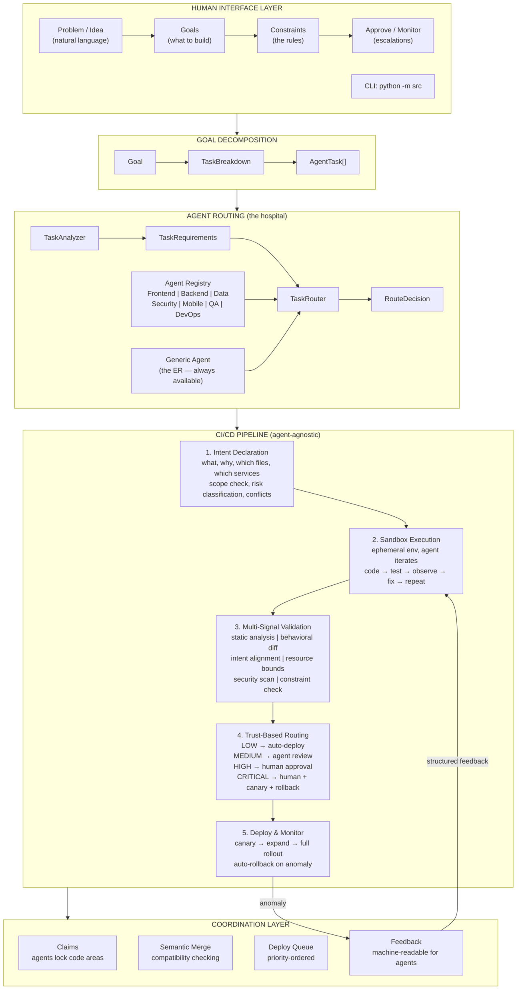
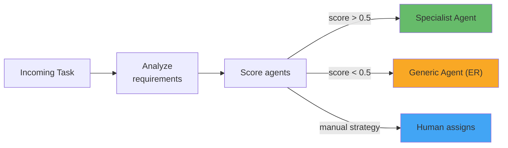
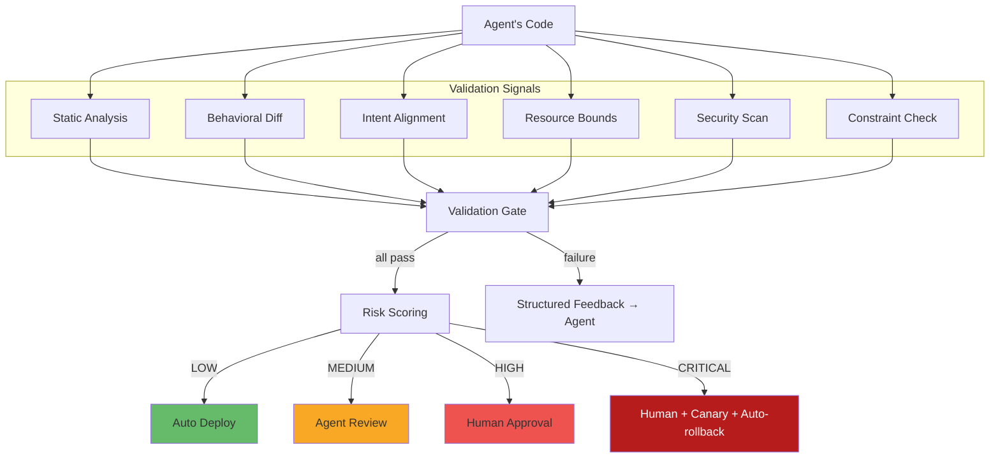
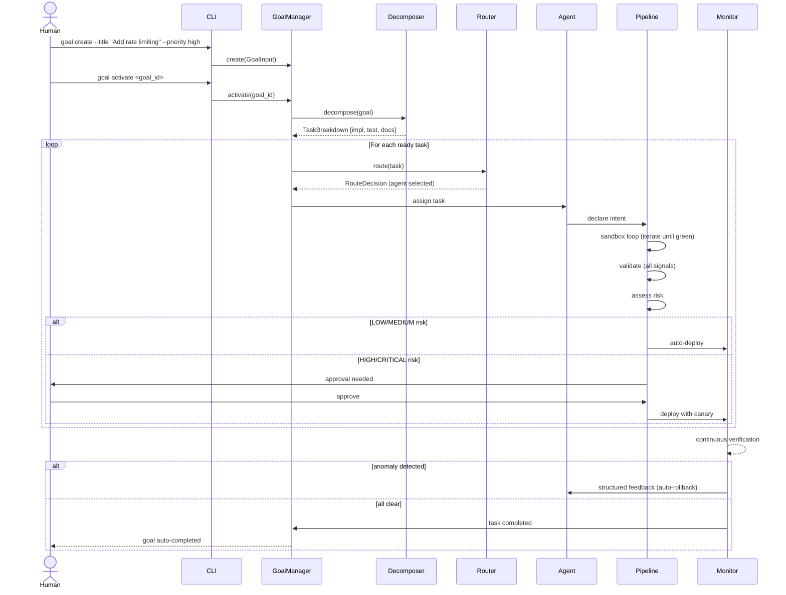
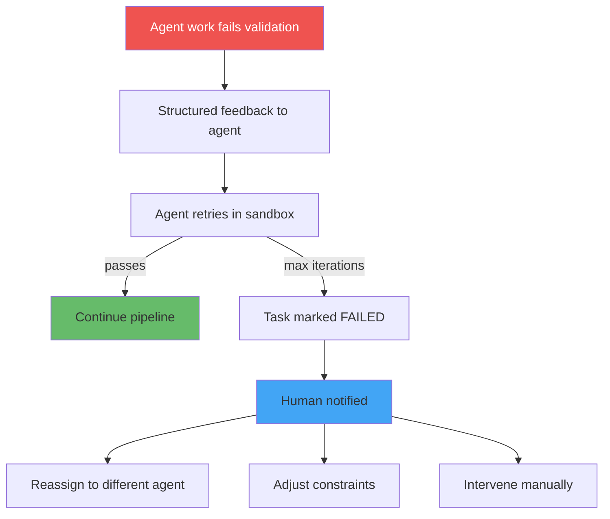
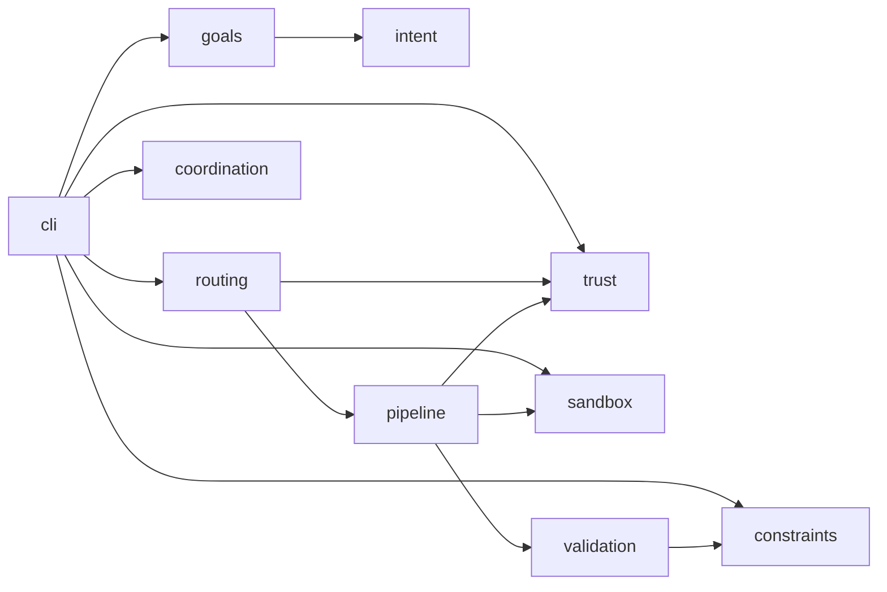

# Shipyard Architecture

> CI/CD reimagined for AI agents. The human is the air traffic controller, not the pilot.

## System Overview

## Components

### Human Interface Layer

| Component | Module | Purpose |
|---|---|---|
| CLI | `src/cli/` | Primary human interface — create goals, approve changes, monitor agents |
| Goals | `src/goals/` | Human expresses WHAT to build, system decomposes into agent tasks |
| Constraints | `src/constraints/` | Architectural rules agents must follow (the "constitution") |

**Human input flow:** Problem/idea --> Goal (title + description + constraints + criteria) --> System handles everything else

### Agent Routing Layer

| Component | Module | Purpose |
|---|---|---|
| Registry | `src/routing/registry.py` | Tracks registered agents, their capabilities, and status |
| Analyzer | `src/routing/analyzer.py` | Extracts task requirements from task description and files |
| Router | `src/routing/router.py` | Matches tasks to best available agent, falls back to generic |

**The hospital model:**
- Specialist agents (cardiologist, neurologist) handle domain-specific tasks
- Generic agent (ER / general practitioner) handles anything no specialist matches
- Trust scores are domain-specific — trusted for frontend doesn't mean trusted for auth
- If no one scores above 0.5, the generic agent takes it

### CI/CD Pipeline (Agent-Agnostic)

| Component | Module | Purpose |
|---|---|---|
| Intent | `src/intent/` | Agent declares what it wants to change and why |
| Sandbox | `src/sandbox/` | Ephemeral execution environment with pluggable backends (simulated or OpenSandbox). Agent iterates until green |
| Validation | `src/validation/` | Multi-signal gate — static, behavioral, security, constraints |
| Trust/Risk | `src/trust/` | Risk scoring, deploy route determination, agent trust tracking |
| Pipeline | `src/pipeline/` | Orchestrates all stages, produces machine-readable feedback |

**Key principle:** The pipeline is agent-agnostic. A frontend agent and a backend agent go through the exact same stages. The pipeline validates work, not identity.

### Coordination Layer

| Component | Module | Purpose |
|---|---|---|
| Claims | `src/coordination/claims.py` | Agents lock code areas to prevent conflicts |
| Merge | `src/coordination/merge.py` | Checks if concurrent changes are compatible |
| Queue | `src/coordination/queue.py` | Priority-ordered deploy queue |
| Feedback | `src/pipeline/feedback.py` | Structured, machine-readable output for agents |

## Data Flow

### Happy Path: Goal to Deploy

### Escalation Path

## Key Design Decisions

1. **Pipeline is agent-agnostic** — specialization is a routing concern, not a pipeline concern. Any agent goes through the same validation.

2. **Generic fallback always available** — the system never gets stuck because no specialist is registered. The generic agent is the ER.

3. **Constraints are a constitution** — no goal can override them. They're checked at validation time, not just at intent time.

4. **Feedback is machine-readable** — every failure, warning, and suggestion is structured data agents can parse and act on. No log dumps for human eyes.

5. **Trust is earned** — new agents start with low trust (more human oversight). Trust grows with successful deploys and shrinks with rollbacks.

6. **Human works at WHAT/WHY level** — humans express problems, set rules, approve high-risk changes. They never write implementation details.

## Module Dependency Graph

## Current Status

| Layer | Status | Tests |
|---|---|---|
| Intent | Built | 21 |
| Sandbox | Built (simulated + OpenSandbox backend) | 46 |
| Validation | Built (real + simulated runners) | 51 |
| Trust/Risk | Built | 27 |
| Coordination | Built | 24 |
| Pipeline | Built | 17 |
| Goals | Built | 37 |
| Constraints | Built | 29 |
| CLI | Built | 45 |
| Routing | Built | 39 |
| API (Command Center) | Built | 15 |
| Storage | Built (memory + SQLite) | 63 |
| LLM | Built (OpenRouter) | 22 |
| SDK | Built | 25 |
| Notifications | Built | 45 |
| Projects | Built | 52 |
| **Total** | | **558** |

## What's Not Built Yet

See [todo.md](./todo.md) for the full list. Key remaining gaps:

- **Integration wiring** — storage, LLM decomposer, and notifications need to be wired into existing managers
- **Behavioral diffing** — traffic replay for semantic change detection
- **UI polish** — structured feedback viewer, config editor, project views in frontend
