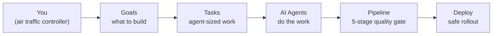
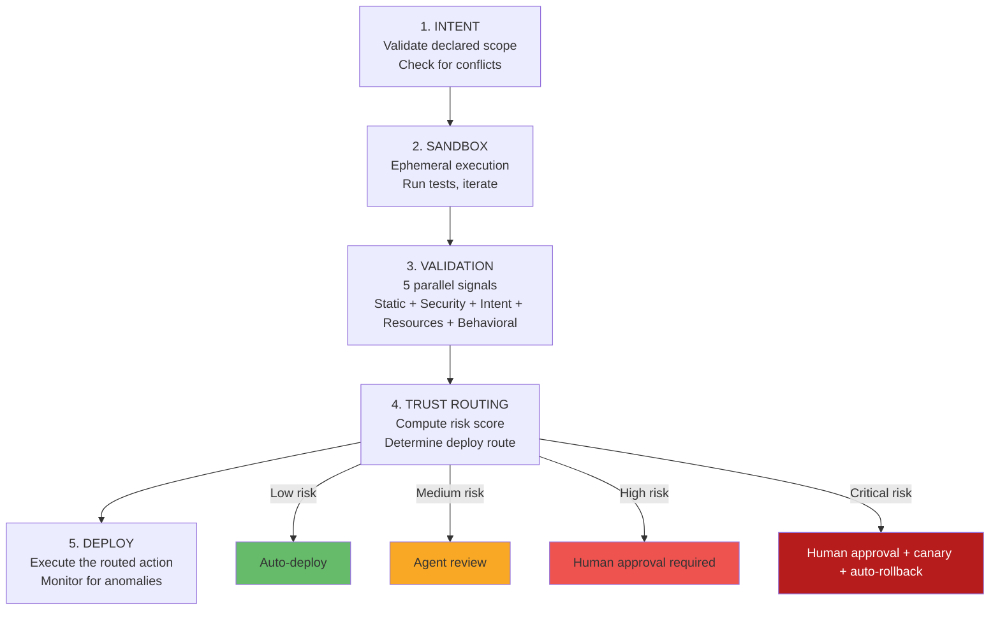
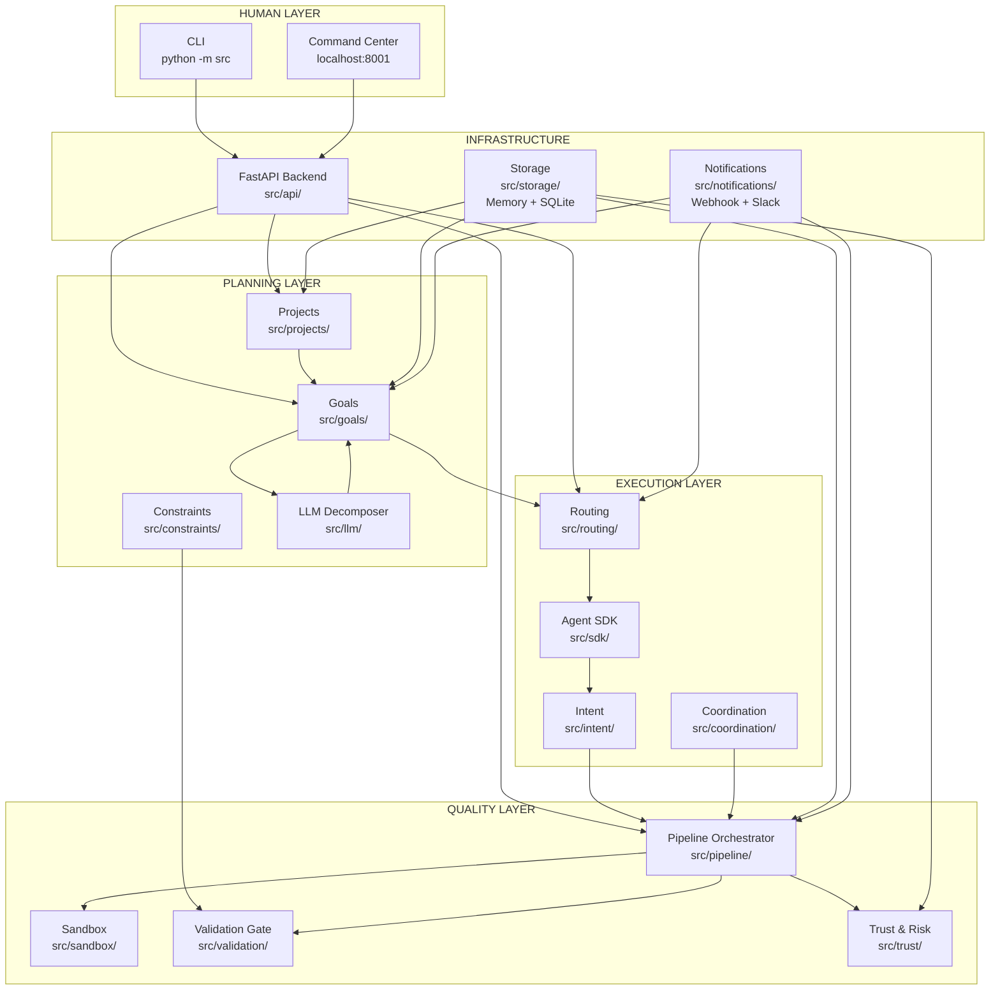
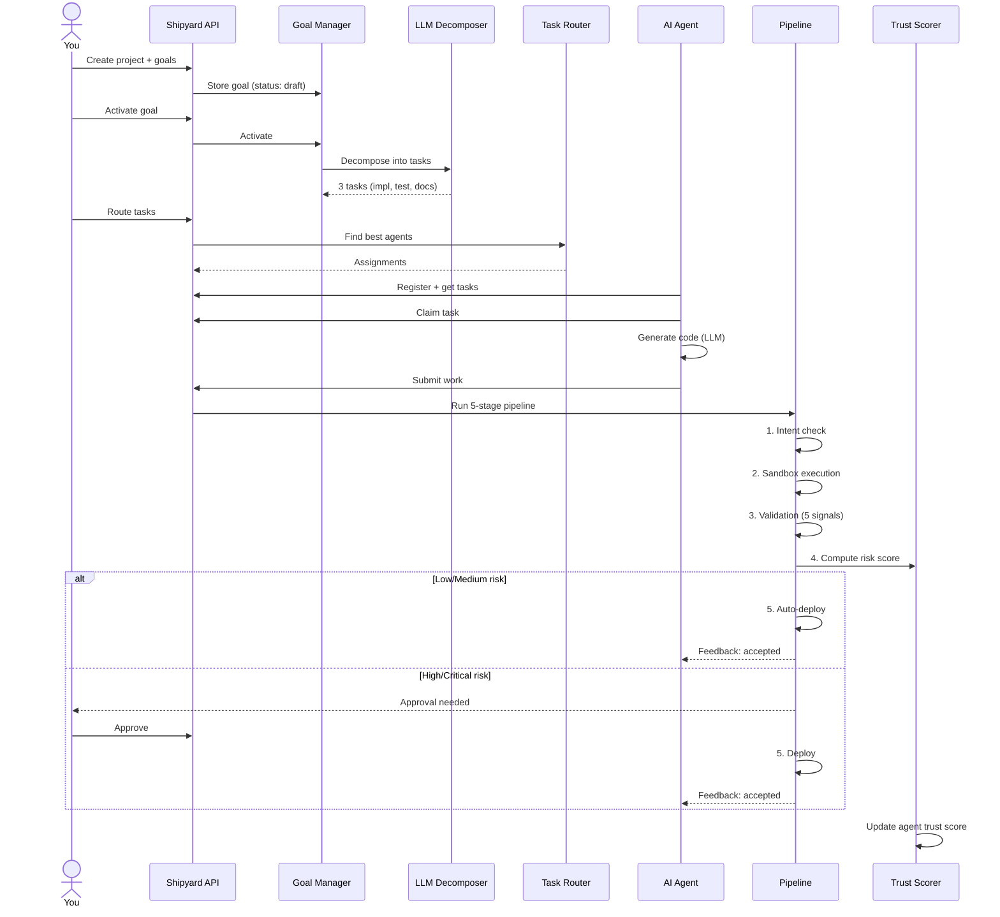

# Shipyard User Guide

A practical guide to using Shipyard, the AI-native CI/CD system where you set goals and agents do the work.

---

## 1. What is Shipyard?

Shipyard is a CI/CD pipeline built for AI agents, not humans. Instead of writing code, pushing commits, and reviewing PRs yourself, you describe **what** you want built and **why** it matters. The system decomposes your goal into tasks, routes them to the best available AI agent, and runs every change through a 5-stage quality pipeline before anything gets deployed. Think of yourself as an **air traffic controller** -- you define the rules of the airspace, approve flight plans when needed, and intervene when something goes wrong. The agents are the pilots. They do the flying.



Your job is three things:
1. **Set Goals** -- describe what you want built in natural language
2. **Define Constraints** -- establish rules agents cannot break (the "constitution")
3. **Approve and Monitor** -- handle escalations, watch trust scores, intervene when needed

---

## 2. Key Concepts

### Projects
The highest-level planning construct. A project represents a scoped body of work (like "Rebuild the billing system") that breaks down into milestones, each containing goals. Projects flow through a lifecycle: draft, planning, active, paused, completed, or cancelled.

### Goals
What you want built, expressed in human language. "Add rate limiting to the API" is a goal. You provide a title, description, optional constraints, and acceptance criteria. The system handles everything else -- decomposing goals into tasks and assigning them to agents.

### Tasks
Agent-sized work items derived from goals. When you activate a goal, the system (using an LLM if configured, or a rule-based fallback) breaks it into concrete tasks like "implement the rate limiting middleware," "write tests," and "update documentation." Each task has target files, constraints inherited from the parent goal, and an estimated risk level.

### Agents
AI workers that register with the system, claim tasks, and submit code changes. Agents can be anything -- a Python script wrapping Claude, a custom LLM integration, or any process that speaks the Shipyard SDK protocol. Each agent declares its capabilities (frontend, backend, security, etc.) and the system routes appropriate work to it.

### Pipeline
The 5-stage quality gate that every change passes through, regardless of which agent made it: Intent, Sandbox, Validation, Trust Routing, and Deploy. If any stage fails, the pipeline halts and sends structured feedback the agent can parse and act on.

### Trust
Agents earn autonomy over time. New agents start with a low trust score (0.1) and every successful deployment increases it. Rollbacks and failures decrease it. Higher trust means more changes can auto-deploy without your review. Trust is domain-specific -- an agent trusted for frontend work is not automatically trusted for authentication changes.

### Constraints
The "constitution" for agents -- inviolable rules that no goal can override. Constraints are checked during validation and block any change that violates them. Examples: "Never commit secrets in source code," "All endpoints require authentication," "Use FastAPI, not Flask or Django." Constraints are defined in `configs/constraints.yaml` with severity levels: MUST (blocking), SHOULD (warning), and PREFER (suggestion).

### Routing
The system that matches tasks to the best available agent using weighted scoring. It considers capability match (35%), language fit (20%), framework knowledge (15%), trust score (20%), and current load (10%). If no specialist scores above 0.5, a generic "ER" agent takes the task -- the system never gets stuck.

---

## 3. Quick Start

### a. Start the server

```bash
uvicorn src.api.app:create_app --factory --host 0.0.0.0 --port 8001
```

This starts the Shipyard API server with the Command Center web UI. If you have `OPENROUTER_API_KEY` set in your environment, LLM-powered goal decomposition is automatically enabled. If you set `SHIPYARD_DB_PATH`, data persists to SQLite; otherwise it runs in-memory.

### b. Open the Command Center

Visit [http://localhost:8001](http://localhost:8001) in your browser. The Command Center is a self-contained SPA with 7 tabs: Dashboard, Goals, Pipeline, Agents, Queue, Constraints, and Projects.

### c. Create a project

**CLI:**
```bash
python -m src project create \
  --title "API Improvements" \
  --description "Harden and optimize the public API" \
  --priority high \
  --tags api backend
```

**API:**
```bash
curl -X POST http://localhost:8001/api/projects \
  -H "Content-Type: application/json" \
  -d '{
    "title": "API Improvements",
    "description": "Harden and optimize the public API",
    "priority": "high",
    "tags": ["api", "backend"]
  }'
```

Then activate it to generate milestones:

```bash
# CLI
python -m src project activate <project_id>

# API
curl -X POST http://localhost:8001/api/projects/<project_id>/activate
```

### d. Create a goal

**CLI:**
```bash
python -m src goal create \
  --title "Add rate limiting" \
  --description "Rate limit /api/users to 100 req/min per client to prevent abuse" \
  --priority high \
  --criteria "Returns 429 when limit exceeded" "Limit is configurable per endpoint"
```

**API:**
```bash
curl -X POST http://localhost:8001/api/goals \
  -H "Content-Type: application/json" \
  -d '{
    "title": "Add rate limiting",
    "description": "Rate limit /api/users to 100 req/min per client to prevent abuse",
    "priority": "high",
    "acceptance_criteria": [
      "Returns 429 when limit exceeded",
      "Limit is configurable per endpoint"
    ]
  }'
```

### e. Activate the goal (decompose into tasks)

Activating a goal triggers decomposition -- the system breaks your goal into agent-sized tasks. If `OPENROUTER_API_KEY` is set, an LLM generates intelligent task breakdowns. Otherwise, a rule-based fallback creates three standard tasks (implementation, testing, documentation).

**CLI:**
```bash
python -m src goal activate <goal_id>
```

**API:**
```bash
curl -X POST http://localhost:8001/api/goals/<goal_id>/activate
```

You'll see output like:
```
Goal activated with 3 task(s):
  - Implement rate limiting middleware  [risk: medium]
  - Write integration tests  [risk: low]
  - Update API documentation  [risk: low]
```

### f. Register an agent

Before agents can claim tasks, they need to register with the system.

**CLI:**
```bash
python -m src agents register \
  --id claude-backend \
  --name "Claude Backend Agent" \
  --capabilities backend,security
```

**API:**
```bash
curl -X POST http://localhost:8001/api/routing/agents \
  -H "Content-Type: application/json" \
  -d '{
    "agent_id": "claude-backend",
    "name": "Claude Backend Agent",
    "capabilities": ["backend", "security"],
    "languages": ["python"],
    "frameworks": ["fastapi"],
    "max_concurrent_tasks": 3
  }'
```

### g. Route tasks to agents

Once agents are registered and a goal has been activated, route its tasks:

**CLI:**
```bash
python -m src route <goal_id>
```

**API:**
```bash
curl -X POST http://localhost:8001/api/routing/route-goal/<goal_id>
```

The system scores each registered agent against each task and assigns work to the best match.

### h. How an agent does work (the SDK flow)

Agents interact with Shipyard through the SDK API. Here is the full lifecycle:

**1. Register**
```
POST /api/agents/sdk/register
Body: { "agent_id": "my-agent", "name": "My Agent", "capabilities": ["python", "api"] }
```

**2. Get available tasks**
```
GET /api/agents/sdk/tasks
Returns: list of TaskAssignment objects with task_id, title, description, constraints, acceptance_criteria
```

**3. Claim a task**
```
POST /api/agents/sdk/tasks/{task_id}/claim
Returns: TaskAssignment with full details
```

**4. Do the work** -- this is where the agent writes code, runs tests, etc.

**5. Submit the work**
```
POST /api/agents/sdk/tasks/{task_id}/submit
Body: {
  "task_id": "...",
  "agent_id": "my-agent",
  "intent_id": "...",  // UUID for this work submission
  "diff": "unified diff of changes",
  "description": "What I did and why",
  "files_changed": ["src/api/middleware.py", "tests/test_middleware.py"]
}
```

This triggers the full 5-stage pipeline. The response is a `FeedbackMessage` with status (`accepted`, `rejected`, or `needs_revision`), a human-readable message, structured validation results, and actionable suggestions.

**6. Get feedback**
```
GET /api/agents/sdk/tasks/{task_id}/feedback
Returns: FeedbackMessage with validation_results, suggestions, and next actions
```

### i. Review and approve

When a high-risk change hits the pipeline, it blocks at the Trust Routing stage and waits for your approval.

**CLI:**
```bash
# See what's waiting for you
python -m src status

# Approve
python -m src approve <run_id>

# Reject with feedback the agent can act on
python -m src reject <run_id> --reason "This bypasses auth. Use the middleware pattern instead."
```

**API:**
```bash
# Approve
curl -X POST http://localhost:8001/api/pipeline/<run_id>/approve

# Reject
curl -X POST http://localhost:8001/api/pipeline/<run_id>/reject \
  -H "Content-Type: application/json" \
  -d '{"reason": "This bypasses auth. Use the middleware pattern instead."}'
```

**Command Center:** Click the Pipeline tab to see all runs. Blocked runs show an Approve/Reject button.

---

## 4. The Pipeline (How Quality is Enforced)

Every change an agent submits goes through five stages, in order. Failure at any stage halts the pipeline and returns structured feedback to the agent.



### What each stage does

| Stage | Purpose | What happens on failure |
|-------|---------|------------------------|
| **Intent** | Validates the agent's declared scope -- what files it plans to change and why. Checks against constraints, detects conflicts with other agents. | Pipeline halts. Agent receives feedback about scope violations or conflicts. |
| **Sandbox** | Runs the code in an ephemeral environment. Agent can iterate (up to 5 times by default) until tests pass. | Pipeline halts after max iterations. Agent gets test output and failure details. |
| **Validation** | Runs 5 signals in parallel: static analysis (ruff), security scan (bandit), intent alignment (LLM), resource bounds, and behavioral diff. Security scan has 2x weight. | Pipeline halts. Agent gets per-signal results with specific issues and suggestions. |
| **Trust Routing** | Computes a risk score from file sensitivity, blast radius, agent trust, validation confidence, and time of day. Maps the score to a deploy route. | Pipeline blocks if human approval is needed. Agent is told to wait. |
| **Deploy** | Executes the routed action -- auto-deploy, canary, or waits for approval. Monitors for anomalies post-deploy. | Auto-rollback triggers. Agent receives structured observations about what went wrong. |

### How trust routing works

The risk score is a weighted combination of factors:

- **File sensitivity** (25%) -- auth files are riskier than CSS
- **Blast radius** (20%) -- how many services/files are affected
- **Agent trust** (20%) -- the agent's historical track record
- **Validation confidence** (20%) -- how strongly the signals passed
- **Time of day** (15%) -- deploys during off-hours are riskier

The score maps to a deploy route:

| Risk Score | Risk Level | Route | What happens |
|------------|------------|-------|--------------|
| 0.00 - 0.34 | Low | Auto-deploy | Ships without review |
| 0.35 - 0.59 | Medium | Agent review | Another agent reviews, then auto-deploys |
| 0.60 - 0.84 | High | Human approval | You must approve before it ships |
| 0.85 - 1.00 | Critical | Human + canary | You approve, it rolls out gradually with auto-rollback |

---

## 5. Building Your First Agent

An agent is just a script that talks to the Shipyard API. There is no special framework required -- if it can make HTTP requests, it can be an agent. The Python SDK (`src/sdk/agent_client.py`) makes this easier, but you can use plain `curl` or any HTTP client.

Here is a complete minimal agent:

```python
"""minimal_agent.py — A simple Shipyard agent."""

import uuid
from src.sdk.agent_client import AgentClient
from src.sdk.protocol import WorkSubmission

# Connect to Shipyard
client = AgentClient(
    base_url="http://localhost:8001",
    agent_id="my-first-agent",
)

# 1. Register
client.register(
    name="My First Agent",
    capabilities=["python", "backend"],
    languages=["python"],
    frameworks=["fastapi"],
)
print("Registered.")

# 2. Get available tasks
tasks = client.get_available_tasks()
if not tasks:
    print("No tasks available.")
    exit()

print(f"Found {len(tasks)} task(s).")
task = tasks[0]
print(f"Claiming: {task.title}")

# 3. Claim the task
assignment = client.claim_task(task.task_id)
print(f"Claimed task: {assignment.title}")
print(f"  Constraints: {assignment.constraints}")
print(f"  Acceptance criteria: {assignment.acceptance_criteria}")

# 4. Do the work
# This is where you plug in Claude, GPT, or any LLM.
# For now, simulate it:
diff = "--- a/src/api/middleware.py\n+++ b/src/api/middleware.py\n@@ -1 +1,5 @@\n+# Rate limiting middleware\n+from fastapi import Request\n"
description = "Added rate limiting middleware with 100 req/min default"

# 5. Submit the work
submission = WorkSubmission(
    task_id=task.task_id,
    agent_id="my-first-agent",
    intent_id=uuid.uuid4(),
    diff=diff,
    description=description,
    files_changed=["src/api/middleware.py"],
)

feedback = client.submit_work(submission)
print(f"\nResult: {feedback.status}")
print(f"Message: {feedback.message}")

if feedback.suggestions:
    print("Suggestions:")
    for s in feedback.suggestions:
        print(f"  - {s}")
```

### Making the agent smart

The "do the work" step (step 4) is where you plug in an LLM as the brain. For example:

- **Claude Code**: Use Claude Code as a subprocess -- give it the task description and constraints, let it generate code, then submit the diff through Shipyard.
- **Anthropic API**: Call the Claude API directly with the task description, target files, and constraints as context. Parse the response as a code diff.
- **Any LLM**: The agent is just a wrapper. The task assignment gives you everything the LLM needs: what to build, what files to touch, what constraints to follow, and what the acceptance criteria are.

The key insight is that Shipyard separates **what to build** (goal/task) from **how to validate it** (pipeline). Your agent only needs to worry about generating good code. The pipeline handles quality assurance.

---

## 6. Trust System

### How trust works

Every agent starts with a baseline trust score of **0.1** (on a 0-1 scale). Trust is computed from three factors:

- **Success rate** (60% weight) -- ratio of successful deployments to total deployments
- **Rollback penalty** (30% weight) -- penalizes agents whose changes get rolled back
- **Tenure bonus** (10% weight) -- ramps from 0 to 1 over 100 deployments, rewarding consistency

Formula: `trust = success_rate * 0.6 + (1 - rollback_rate) * 0.3 + tenure_bonus * 0.1`

### Domain-specific trust

Trust is tracked per domain. An agent that has 50 successful frontend deploys might have high trust for frontend work but still low trust for security changes. The system stores domain-specific scores separately, so routing and risk assessment consider domain trust, not just overall trust.

### The four deploy routes

| Route | When | Your involvement |
|-------|------|------------------|
| **Auto-deploy** | Low risk + high trust | None -- it ships |
| **Agent review** | Medium risk | A supervisor agent reviews. You only see it if the reviewer flags it. |
| **Human approval** | High risk or low trust | You review the change, validation results, and risk assessment. You approve or reject with feedback. |
| **Canary** | Critical risk | You approve. The change rolls out to a small percentage of traffic first. Auto-rollback if anomalies are detected. |

### What this means in practice

A new agent submitting its first change will almost always need your approval (low trust = higher risk score). As it builds a track record of successful deploys, its trust increases and more of its changes auto-deploy. If it causes a rollback, trust drops and the system tightens oversight automatically. You never have to manually manage permissions -- the system adapts.

---

## 7. Configuration

### Config files

| File | Purpose |
|------|---------|
| `configs/default.yaml` | Risk thresholds, signal weights, trust parameters, sandbox limits, monitoring thresholds |
| `configs/constraints.yaml` | Architectural rules agents must follow -- the "constitution" |

### Key settings you can tweak

**Risk thresholds** -- Control how much autonomy agents get:
```yaml
risk_thresholds:
  critical: 0.85    # Score >= 0.85 = critical risk
  high: 0.60        # Score >= 0.60 = high risk (needs your approval)
  medium: 0.35      # Score >= 0.35 = medium risk (agent review)
  low: 0.0          # Below 0.35 = auto-deploy
```

Lower the `high` threshold to require your approval more often. Raise it to give agents more freedom.

**Validation signal weights** -- Which signals matter most:
```yaml
signal_weights:
  static_analysis: 1.0
  behavioral_diff: 1.5
  intent_alignment: 1.2
  resource_bounds: 1.0
  security_scan: 2.0       # Security has the most influence
```

**Risk factor weights** -- What contributes to the risk score:
```yaml
risk_factor_weights:
  file_sensitivity: 0.25   # Auth files = risky, CSS = not
  blast_radius: 0.20       # How many files/services affected
  agent_trust: 0.20        # Agent's track record
  validation_confidence: 0.20
  time_of_day: 0.15        # Off-hours deploys are riskier
```

**Trust parameters:**
```yaml
trust:
  baseline_trust: 0.1           # New agents start here
  tenure_ramp_deployments: 100  # Deploys to reach full tenure bonus
```

### Environment variables

| Variable | Purpose | Default |
|----------|---------|---------|
| `SHIPYARD_DB_PATH` | Path to SQLite database for persistent storage | In-memory (no persistence) |
| `OPENROUTER_API_KEY` | Enables LLM-powered goal decomposition and intent alignment | Rule-based fallback |
| `OPENSANDBOX_SERVER_URL` | URL of an OpenSandbox server for real sandboxed execution | Simulated sandbox |

---

## 8. Command Reference

### CLI Commands

| Command | Example | Description |
|---------|---------|-------------|
| `status` | `python -m src status` | Overview of active runs, pending approvals, queue |
| `goal create` | `python -m src goal create --title "..." --description "..." --priority high` | Create a new goal |
| `goal list` | `python -m src goal list --status active` | List goals (optionally filter by status/priority) |
| `goal activate` | `python -m src goal activate <goal_id>` | Decompose goal into tasks |
| `goal show` | `python -m src goal show <goal_id>` | Show goal details and its tasks |
| `goal cancel` | `python -m src goal cancel <goal_id>` | Cancel a goal |
| `project create` | `python -m src project create --title "..." --description "..."` | Create a new project |
| `project list` | `python -m src project list` | List projects |
| `project show` | `python -m src project show <project_id>` | Show project details and milestones |
| `project activate` | `python -m src project activate <project_id>` | Plan milestones and start the project |
| `approve` | `python -m src approve <run_id>` | Approve a blocked pipeline run |
| `reject` | `python -m src reject <run_id> --reason "..."` | Reject with feedback for the agent |
| `route` | `python -m src route <goal_id>` | Auto-route all tasks for a goal |
| `agents` | `python -m src agents` | List agents with trust scores |
| `agents register` | `python -m src agents register --id bot1 --name "Bot 1" --capabilities backend,security` | Register a new agent |
| `runs` | `python -m src runs --status passed --limit 10` | List pipeline runs |
| `queue` | `python -m src queue` | Show the deploy queue |
| `constraints show` | `python -m src constraints show` | Display active constraints |
| `constraints check` | `python -m src constraints check <file>` | Check a file against constraints |

### API Endpoints

**Goals**

| Method | Endpoint | Description |
|--------|----------|-------------|
| `POST` | `/api/goals` | Create a goal |
| `GET` | `/api/goals` | List goals (query: `?status=active&priority=high`) |
| `GET` | `/api/goals/{goal_id}` | Get goal with tasks |
| `POST` | `/api/goals/{goal_id}/activate` | Activate (decompose into tasks) |
| `POST` | `/api/goals/{goal_id}/cancel` | Cancel a goal |

**Projects**

| Method | Endpoint | Description |
|--------|----------|-------------|
| `POST` | `/api/projects` | Create a project |
| `GET` | `/api/projects` | List projects (query: `?status=active`) |
| `GET` | `/api/projects/{project_id}` | Get project details |
| `POST` | `/api/projects/{project_id}/activate` | Activate project |
| `POST` | `/api/projects/{project_id}/cancel` | Cancel project |
| `GET` | `/api/projects/{project_id}/milestones` | List milestones |
| `POST` | `/api/projects/{project_id}/milestones/{milestone_id}/complete` | Complete a milestone |
| `GET` | `/api/projects/{project_id}/goals` | List goals in project |

**Routing**

| Method | Endpoint | Description |
|--------|----------|-------------|
| `GET` | `/api/routing/agents` | List registered agents |
| `POST` | `/api/routing/agents` | Register an agent |
| `GET` | `/api/routing/agents/{agent_id}` | Get agent details + trust |
| `PUT` | `/api/routing/agents/{agent_id}/status` | Update agent status (available/busy/offline/paused) |
| `DELETE` | `/api/routing/agents/{agent_id}` | Unregister an agent |
| `POST` | `/api/routing/route/{task_id}` | Route a specific task |
| `POST` | `/api/routing/route-goal/{goal_id}` | Auto-route all tasks for a goal |
| `GET` | `/api/routing/decisions` | List recent routing decisions |

**Agent SDK**

| Method | Endpoint | Description |
|--------|----------|-------------|
| `POST` | `/api/agents/sdk/register` | Register agent (from agent side) |
| `GET` | `/api/agents/sdk/tasks` | List available tasks |
| `POST` | `/api/agents/sdk/tasks/{task_id}/claim` | Claim a task |
| `POST` | `/api/agents/sdk/tasks/{task_id}/submit` | Submit work (triggers pipeline) |
| `GET` | `/api/agents/sdk/tasks/{task_id}/feedback` | Get feedback for submitted task |

**Pipeline**

| Method | Endpoint | Description |
|--------|----------|-------------|
| `POST` | `/api/pipeline/{run_id}/approve` | Approve a blocked run |
| `POST` | `/api/pipeline/{run_id}/reject` | Reject a run with feedback |

---

## 9. What's Real vs Simulated

Shipyard is a working system, but some components are fully integrated and others use simulation layers as placeholders for production infrastructure.

### Real and working today

- **Persistent storage** -- SQLite backend with the repository pattern. Set `SHIPYARD_DB_PATH` to persist data across restarts.
- **LLM goal decomposition** -- When `OPENROUTER_API_KEY` is set, goals are decomposed using an LLM (via OpenRouter) with a rule-based fallback.
- **Static analysis** -- Uses `ruff` for real Python linting with JSON output and severity mapping.
- **Security scanning** -- Uses `bandit` for real security vulnerability detection with severity mapping.
- **Intent alignment** -- LLM-based checking that agent output matches declared intent (requires `OPENROUTER_API_KEY`).
- **Agent routing** -- Full weighted scoring system with agent registry, task analysis, and domain-specific trust.
- **Webhook notifications** -- Event dispatcher with webhook and Slack channels, HMAC signing, 15 event types.
- **Trust scoring** -- Computed from deployment history, domain-specific, updates automatically.
- **Command Center** -- Fully functional web UI with 7 views, WebSocket support, dark theme.
- **CLI** -- Full command set for goals, projects, agents, pipeline, queue management.
- **Agent SDK** -- Complete protocol for agents to register, claim, submit, and receive feedback.

### Simulated / placeholder

- **Sandbox execution** -- By default, sandbox runs are simulated (always pass). To enable real sandboxed execution, set `OPENSANDBOX_SERVER_URL` to point to an OpenSandbox server.
- **Behavioral diffing** -- Not yet implemented. The signal always passes. This is the hardest component to build (needs traffic replay infrastructure).
- **Resource bounds checking** -- Returns simulated results. Would need runtime metrics from the sandbox.
- **Post-deploy monitoring** -- Anomaly detection logic exists but is not connected to real metrics sources.

### What this means in practice

You can use Shipyard today for the full goal-to-task-to-agent-to-pipeline flow. Static analysis and security scanning are real checks that will catch actual issues. Trust scoring, routing, and notifications all work. The main gap is that the sandbox does not actually execute code in an isolated environment unless you configure OpenSandbox, and behavioral diffing is not yet functional. In practice, this means the pipeline validates structure and security but does not verify runtime behavior.

---

## 10. Architecture Overview



### Data flow: Project to Deploy



---

## Getting Help

- **System status**: `python -m src status` or visit the Command Center dashboard
- **View recent runs**: `python -m src runs`
- **Check agent health**: `python -m src agents`
- **Architecture details**: See `docs/architecture.md`
- **What is left to build**: See `docs/todo.md`
- **Source code**: All 16 modules live under `src/` with one test file per module in `tests/`
