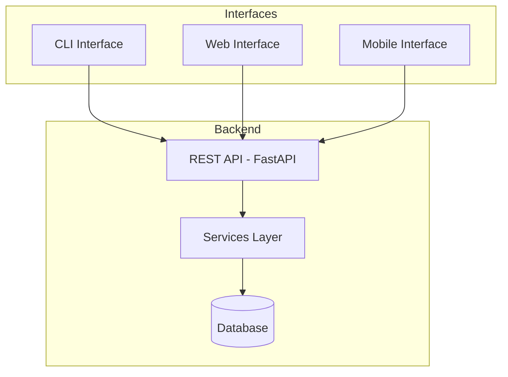
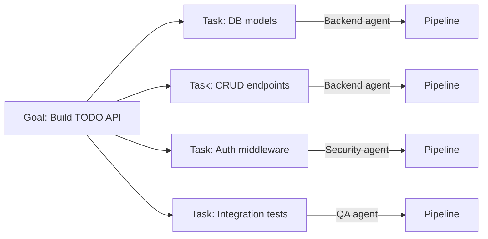
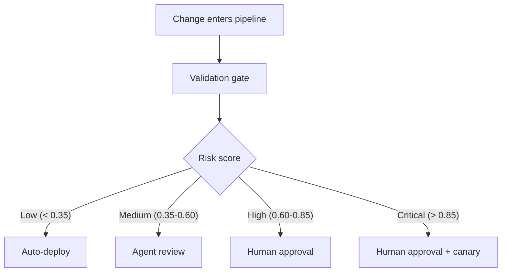
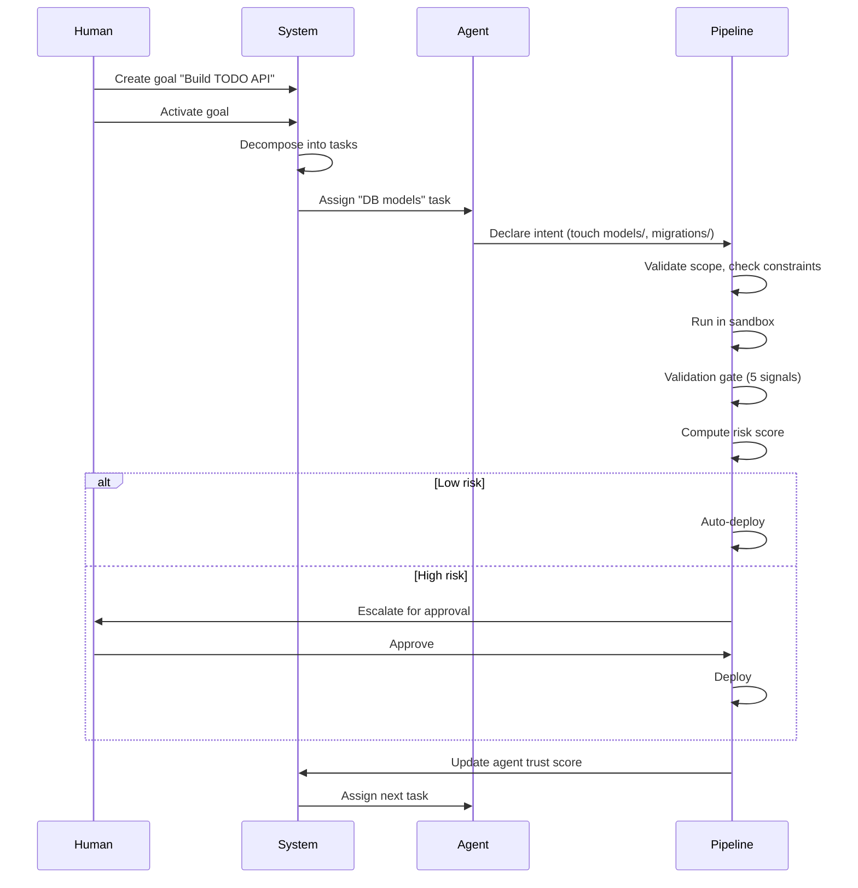

# How To: Setting Up AI-CICD for a TODO App

A walkthrough of setting up the AI-native CI/CD pipeline using a real example — a TODO application with CLI, web, and mobile interfaces.

## The Example Project

A TODO app with three interfaces sharing a common backend:



## Step 1: Install the Pipeline

```bash
pip install -e ".[dev]"
```

Verify it works:

```bash
python -m src status
```

## Step 2: Define Your Constraints

Before any goals, set the rules agents must follow. Constraints are your constitution — agents cannot override them.

The default constraints live in `configs/constraints.yaml`. Review them and customize for your project:

```bash
python -m src constraints show
```

For the TODO app, the defaults already cover the important rules (no raw SQL, repository pattern, pydantic validation, no secrets in code, etc.). You'd add project-specific ones like:

```bash
python -m src constraint add --rule "All TODO mutations must emit an event for sync across interfaces"
python -m src constraint add --rule "Mobile API responses must be under 50KB"
python -m src constraint add --rule "CLI commands must work offline with local SQLite fallback"
```

> **Not built yet:** The `constraint add` CLI command exists but doesn't persist to `constraints.yaml`. Currently you edit the YAML file directly.

## Step 3: Create Goals

You express WHAT to build. Agents figure out HOW.

### Goal 1: The Backend API

```bash
python -m src goal create \
  --title "Build TODO REST API" \
  --description "CRUD API for TODO items with user auth. Fields: title, description, due_date, priority (low/med/high), completed status, tags. Support filtering, sorting, and pagination." \
  --priority high \
  --services api
```

### Goal 2: The CLI Interface

```bash
python -m src goal create \
  --title "Build TODO CLI" \
  --description "Terminal interface for managing TODOs. Commands: add, list, complete, delete, search. Support offline mode with local SQLite that syncs when online." \
  --priority medium \
  --services cli
```

### Goal 3: The Web Interface

```bash
python -m src goal create \
  --title "Build TODO web app" \
  --description "Web UI for managing TODOs. Drag-and-drop reordering, keyboard shortcuts, dark mode. Real-time sync across tabs." \
  --priority medium \
  --services web
```

### Goal 4: The Mobile Interface

```bash
python -m src goal create \
  --title "Build TODO mobile app" \
  --description "Mobile app for managing TODOs. Push notifications for due dates, offline support, swipe gestures for complete/delete." \
  --priority medium \
  --services mobile
```

## Step 4: Activate Goals

Activating a goal decomposes it into tasks and assigns them to agents.

```bash
# List goals to get the IDs
python -m src goal list

# Activate the API goal first (other interfaces depend on it)
python -m src goal activate <api_goal_id>
```

The system decomposes the goal into tasks (e.g., "set up database models", "implement CRUD endpoints", "add auth middleware") and assigns each to the best-matched agent based on capabilities, language, and trust score.



> **Not built yet:** Goal decomposition currently returns placeholder tasks. Real LLM-powered decomposition is planned.

## Step 5: Monitor Progress

Once goals are activated, agents work autonomously. Your job is to monitor.

```bash
# Dashboard: active runs, pending approvals, deploy queue
python -m src status

# Recent pipeline runs
python -m src runs

# Agent trust scores and activity
python -m src agents

# Code area claims (which agent is working on what)
python -m src claims
```

## Step 6: Handle Escalations

The pipeline routes changes based on computed risk:



Most changes deploy without you. You get escalated for high-risk changes like:
- Database migrations
- Auth changes
- Infrastructure modifications

When escalated:

```bash
# Review what the agent did and why
python -m src runs

# Approve
python -m src approve <run_id>

# Or reject with actionable feedback
python -m src reject <run_id> --reason "Use middleware for auth, not decorator-per-route"
```

Rejections are sent to the agent as structured feedback — it will retry with your guidance.

## Step 7: Tune Over Time

As agents build trust through successful deployments:

```bash
# Check how agents are performing
python -m src agents

# Adjust risk thresholds in configs/default.yaml
# Lower thresholds = more human oversight
# Higher thresholds = more agent autonomy
```

Key settings in `configs/default.yaml`:

| Setting | Default | What it controls |
|---------|---------|-----------------|
| `risk_thresholds.critical` | 0.85 | Above this → human + canary |
| `risk_thresholds.high` | 0.60 | Above this → human approval |
| `risk_thresholds.medium` | 0.35 | Above this → agent review |
| `trust.baseline` | 0.3 | Starting trust for new agents |

## What the Full Lifecycle Looks Like

For the TODO app, here's what happens end-to-end after you create and activate goals:



## What's Not Built Yet

| Feature | Status | Impact on this workflow |
|---------|--------|----------------------|
| **Real sandbox** (Docker/K8s) | OpenSandbox backend available | Set `OPENSANDBOX_SERVER_URL` for real container execution; defaults to simulated |
| **LLM goal decomposition** | Placeholder | Goals decompose into generic placeholder tasks, not real task breakdowns |
| **Validation signals** | Simulated | Static analysis, security scan, etc. return simulated results |
| **Persistent storage** | In-memory | All state is lost when the process stops — goals, runs, trust scores |
| **Agent SDK** | Not started | No protocol for external agents to connect and pick up tasks |
| **Webhook notifications** | Not started | No Slack/email alerts for escalations — must poll with `status` |
| **Continuous verification** | Not started | No post-deploy monitoring or automatic rollback |
| **`constraint add` persistence** | Not started | CLI command exists but doesn't write to `constraints.yaml` |

Despite these gaps, the pipeline logic, routing, trust scoring, constraint checking, and CLI are fully functional and tested (311 tests). You can run through this entire workflow today — the simulated components behave like the real ones will, just without actual code execution or LLM calls.
