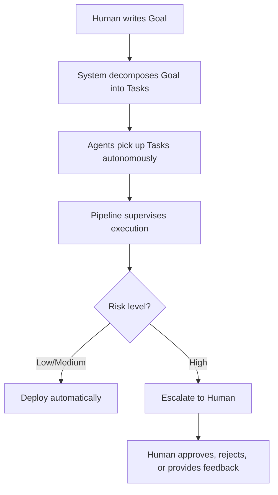
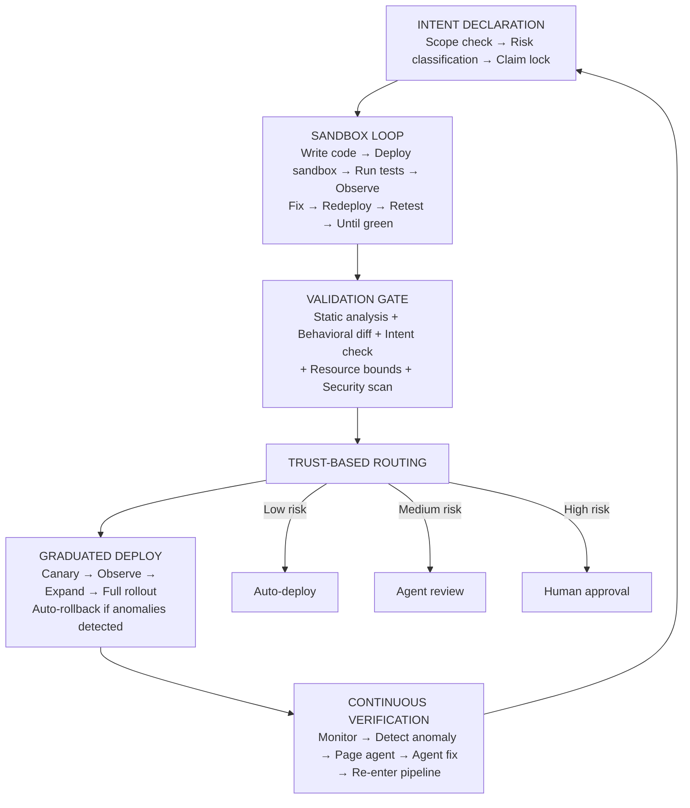

# AI-Native CI/CD: Vision Document

## The Problem

Traditional CI/CD pipelines are designed for humans. They assume a developer writes code, pushes it to a repository, and a deterministic pipeline validates the result. AI agents break this model fundamentally — they operate continuously, iteratively, and non-deterministically. We need a pipeline that shifts from **gate-checking human work** to **supervising autonomous work**.

## Core Differences from Traditional CI/CD

| Dimension | Human CI/CD | Agent CI/CD |
|---|---|---|
| **Trigger** | Git push / PR | Agent decides to ship, or continuous |
| **Trust model** | Trust the code, verify with tests | Trust nothing — verify intent, code, AND behavior |
| **Feedback loop** | Human reads logs, fixes | Agent consumes structured feedback, retries |
| **Rollback** | Human decision | Automatic with anomaly detection |
| **Review** | Human PR review | Layered: agent self-review, supervisor agent, human escalation |

## The Human Interface

The human operator in an AI-native CI/CD system is an **air traffic controller, not a pilot**. You do not fly the planes — you set the rules of the airspace, approve flight plans, and intervene when something goes wrong. The agents do the flying.

### What Humans Do

Humans contribute three things to this system:

1. **Set Goals** — Express *what* to build and *why* it matters. "Add rate limiting to the API" is a goal. How to implement it, which library to use, how to structure the code — that is the agent's job. The human works at the WHAT/WHY level, never the HOW level.

2. **Define Constraints** — Establish architectural rules, security requirements, and boundaries that agents must respect. These constraints act as a **constitution** for agents: inviolable rules that no goal can override. Examples: "Never expose PII in logs," "All new endpoints require auth," "Database migrations must be backwards-compatible."

3. **Approve and Monitor** — Handle escalations from the trust-based routing system, watch agent trust scores over time, and intervene when anomalies arise. Most work flows through without human involvement; humans only engage for high-risk changes and novel situations.

### The Flow



The constraint system ensures that even when changes deploy automatically, they stay within the boundaries the human has defined. Agents cannot override constraints — they can only work within them or escalate when a constraint blocks progress.

## Architecture

### 1. Intent Layer

Before any code is written, the agent declares *what it intends to change and why*. This gets validated against:

- **Scope constraints** — is the agent authorized to touch this service?
- **Risk classification** — data layer change vs. CSS tweak
- **Conflict detection** — is another agent working on the same area?

The intent declaration is a first-class artifact, not a commit message afterthought.

### 2. Sandbox-First Execution

Agents don't get a "local environment." Every change runs in an ephemeral sandbox immediately. There is no distinction between "dev" and "CI" — it's always CI.

```
Agent writes code -> instant sandbox deploy -> tests run -> agent observes results -> iterates
```

This loop happens **before** anything touches version control. Git becomes a record of validated outcomes, not a scratchpad.

### 3. Multi-Signal Validation

Tests alone aren't enough when agents generate code. Validation requires multiple independent signals:

- **Static analysis** — did the agent introduce vulnerabilities, break APIs?
- **Behavioral diffing** — does the running service behave differently? (traffic replay, shadow mode)
- **Intent alignment** — does the output match the declared intent? (another agent or LLM judges this)
- **Resource boundaries** — did the change blow up cost, latency, memory?

### 4. Graduated Trust & Autonomy

Not a binary pass/fail gate. A spectrum based on computed risk:

```
Low risk   -> auto-deploy (typo fix, config change)
Med risk   -> supervisor agent reviews -> auto-deploy
High risk  -> human approval required
Critical   -> human approval + canary + auto-rollback
```

Risk is computed dynamically from: what files changed, blast radius, historical reliability of the agent, time of day, system load.

### 5. Continuous Verification

Post-deploy isn't the end. The pipeline keeps watching:

- Anomaly detection on metrics, logs, error rates
- Automatic rollback with explanation generation
- The agent that shipped the change is **on call** — it gets paged with structured observations and is expected to respond

### 6. Agent Coordination Layer

When multiple agents work on a codebase:

- **Claim system** — agents lock areas they're modifying
- **Semantic merge** — not just textual git merge, but understanding if two changes are logically compatible
- **Priority arbitration** — which agent's change lands first based on urgency/importance

## Pipeline Flow



## The Biggest Mindset Shifts

### From conveyor belt to supervision system

Today's CI/CD is a conveyor belt with checkpoints. Agent CI/CD is a supervision system. The pipeline isn't something the agent passes through — it wraps around the agent at all times. The agent is never "done" and the pipeline never "finishes."

### Machine-readable feedback

Every test failure, lint warning, and deployment metric needs to be structured data the agent can consume and act on — not log dumps designed for human eyeballs. This is a prerequisite for the autonomous sandbox loop to work.

### Git as audit log, not workspace

Version control becomes the record of what was validated and shipped, not the mechanism through which work is coordinated. Coordination happens at the intent and claim layer.

## What's Next

This document outlines the *what* and *why*. The next steps are:

1. Define the intent declaration schema
2. Design the sandbox environment provisioning system
3. Build the multi-signal validation framework
4. Implement the trust/risk scoring model
5. Create the agent coordination protocol
